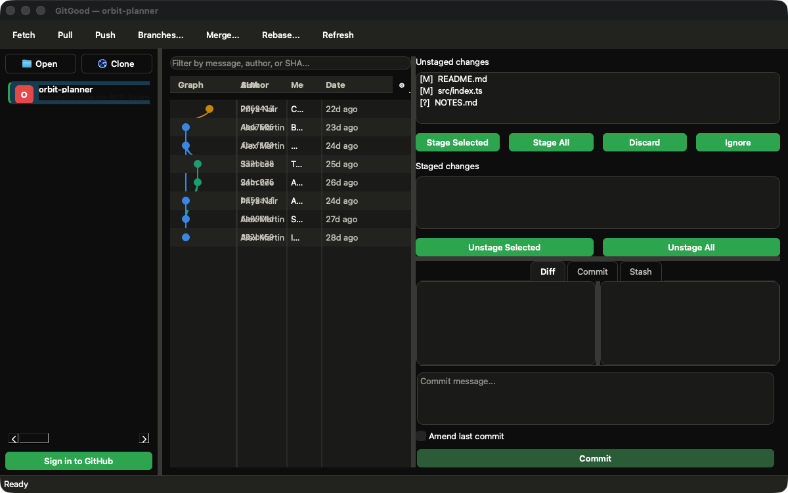

# GitGood

A lightweight desktop Git client for macOS written in Python with PySide6 (Qt), in the spirit of GitHub Desktop / Fork: open several repositories in a sidebar, browse the commit graph, stage and commit, and run the everyday remote operations — with GitHub sign-in through the OAuth device flow.

## Screenshot

*A throw-away demo repository with fictional authors.*



## Features

- **Repository sidebar**: open local repositories or clone one (from a URL or from your GitHub repositories once signed in); each repo gets its own tab.
- **Commit graph** with real branch columns, filter by message / author / SHA, and per-commit diffs.
- **Working copy**: unstaged / staged lists, stage / unstage / discard / ignore, side-by-side diff view, commit (with *amend*).
- **Remote operations**: fetch, pull, push, branches, merge, rebase — run in background workers so the UI never freezes.
- **Stash** panel and a **conflict resolver**.
- **GitHub sign-in** with the OAuth device flow (no personal access token to paste). The token is stored in the macOS Keychain and forwarded to HTTPS remotes.
- Light and dark themes following the system appearance.

## Getting started

```bash
python3 -m venv .venv
source .venv/bin/activate
pip install -r requirements.txt
PYTHONPATH=src python -m gitgood.main [path/to/repo]
```

### GitHub sign-in

Create a GitHub OAuth App with **Device Flow** enabled and put its Client ID in `CLIENT_ID` in `src/gitgood/auth/github_oauth.py`. Until then the app works fully for local repositories and plain Git remotes; only the GitHub sign-in is disabled.

### Tests

```bash
PYTHONPATH=src pytest
```

## Build a macOS app

```bash
pip install -r requirements-build.txt
./build.sh        # dist/GitGood.app via py2app, trimmed and ad-hoc signed
```

`build.sh` strips the Qt modules the app doesn't use (py2app bundles the whole PySide6 distribution otherwise) and signs the bundle afterwards.

## Project structure

```
src/gitgood/
  app.py, main.py      application bootstrap and theme
  git_ops/             repository state, commit graph layout, clone (GitPython)
  auth/                GitHub OAuth device flow, API client, Keychain storage
  ui/                  main window, repo tabs, dialogs and widgets
  workers/             background Git / clone workers
tests/                 pytest suite
resources/             app icon
```
